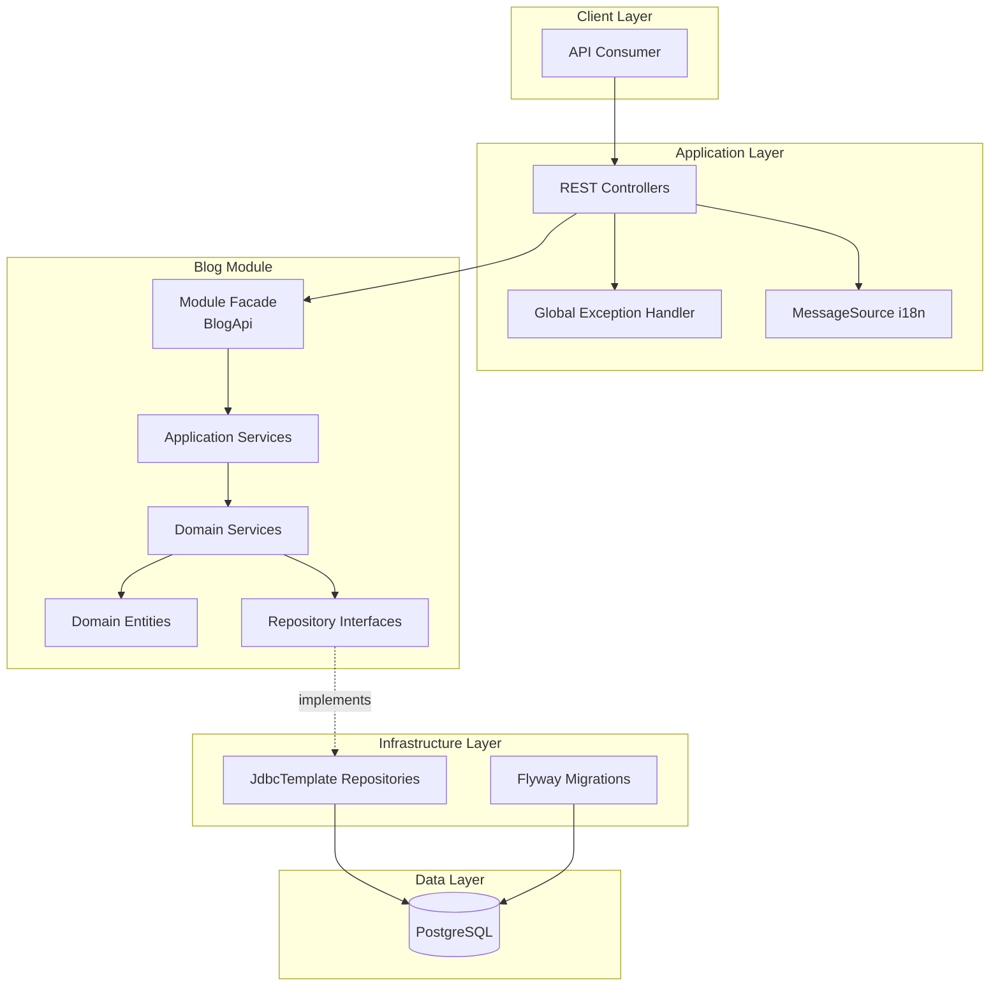
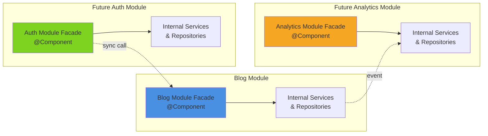
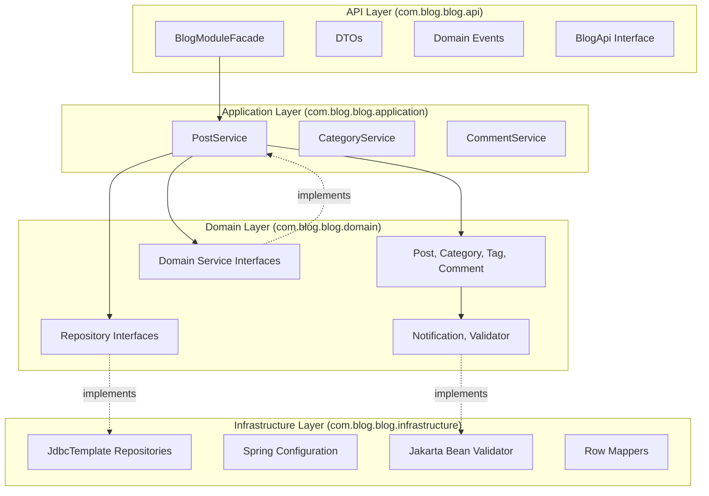
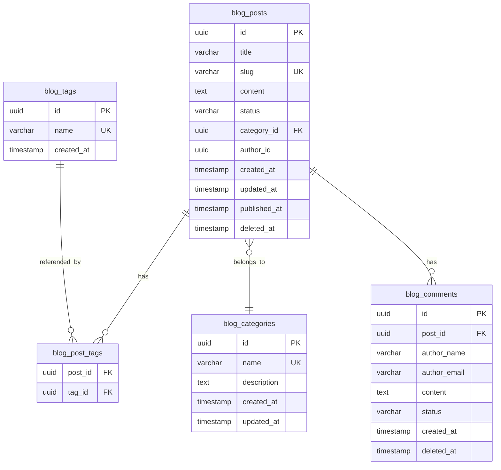
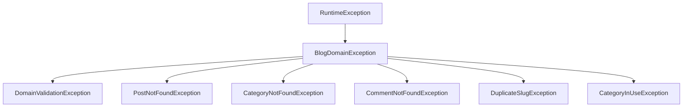

# Design Document: Personal Blog API - Modular Monolith

## Overview

### Purpose

The Personal Blog API is a modular monolithic application built with Java 21 and Spring Boot, designed to provide a robust, scalable, and maintainable blog platform. The system implements Domain-Driven Design (DDD) principles with clear module boundaries, enabling independent development and testing of business capabilities while maintaining a single deployable artifact.

### Key Design Decisions

1. **Modular Monolith Architecture**: The system is structured as a single deployable JAR with clear module boundaries enforced through package organization and ArchUnit tests, enabling future extraction to microservices if needed.

2. **JdbcTemplate over JPA/Hibernate**: Direct SQL control using JdbcTemplate provides explicit query management, better performance visibility, and simpler testing with H2 in-memory database for repository tests.

3. **Notification Pattern for Validation**: Following Martin Fowler's Notification Pattern, validation errors are accumulated before throwing exceptions, providing comprehensive feedback to API consumers.

4. **HATEOAS with Spring HATEOAS**: Implementing REST Maturity Level 3 using HAL format for hypermedia responses, enabling dynamic API navigation and reducing coupling between client and server.

5. **Interface-Based Design**: All repositories and domain services are defined as interfaces, enabling pure unit testing with mocks and maintaining dependency inversion.

6. **Internationalization-First**: All user-facing messages are externalized through Spring MessageSource, supporting en-US, pt-BR, and es-ES from day one.

### Technology Stack

- **Language**: Java 21 (Records, Text Blocks, Pattern Matching, Sealed Classes)
- **Framework**: Spring Boot 3.2+
- **Persistence**: JdbcTemplate with PostgreSQL 16
- **Database Migrations**: Flyway
- **Hypermedia**: Spring HATEOAS (HAL format)
- **Testing**: JUnit 5, Mockito, Testcontainers, H2
- **Architecture Testing**: ArchUnit


## Architecture

### High-Level Architecture Diagram




### Module Boundaries and Communication



**Module Communication Rules:**

1. **Synchronous Communication**: Modules communicate synchronously only through Module Facades, never directly to internal services or repositories
2. **Asynchronous Communication**: Modules publish domain events using `ApplicationEventPublisher` for loose coupling
3. **Data Isolation**: Each module's tables use a distinct prefix (e.g., `blog_`, `auth_`, `analytics_`)
4. **Dependency Direction**: External modules can depend on a module's API contract, never on its internal implementation


### Layered Architecture within Blog Module



**Layer Dependency Rules:**

- **API Layer**: Exposes public contracts, DTOs, and events. Can depend on application and domain layers for internal implementation.
- **Application Layer**: Orchestrates use cases, coordinates domain services and repositories. Depends on domain layer only.
- **Domain Layer**: Contains business logic, entities, and interfaces. Has no dependencies on other layers (pure domain).
- **Infrastructure Layer**: Implements technical concerns (persistence, configuration). Depends on domain interfaces.


## Components and Interfaces

### Package Structure

```
com.blog.blog/
├── api/
│   ├── facade/
│   │   └── BlogModuleFacade.java          # @Component, implements BlogApi
│   ├── dto/
│   │   ├── PostDTO.java                   # Record
│   │   ├── CategoryDTO.java               # Record
│   │   ├── CommentDTO.java                # Record
│   │   ├── CreatePostRequest.java         # Record with validation
│   │   ├── UpdatePostRequest.java         # Record
│   │   └── CreateCommentRequest.java      # Record with validation
│   ├── events/
│   │   ├── PostPublishedEvent.java        # Record
│   │   └── CommentCreatedEvent.java       # Record
│   └── BlogApi.java                       # Interface (module contract)
│
├── application/
│   ├── service/
│   │   ├── PostService.java               # Interface
│   │   ├── PostServiceImpl.java           # @Service
│   │   ├── CategoryService.java           # Interface
│   │   ├── CategoryServiceImpl.java       # @Service
│   │   ├── CommentService.java            # Interface
│   │   └── CommentServiceImpl.java        # @Service
│   └── usecase/
│       ├── PublishPostUseCase.java
│       └── ListPostsUseCase.java
│
├── domain/
│   ├── model/
│   │   ├── Post.java                      # Entity
│   │   ├── Category.java                  # Entity
│   │   ├── Tag.java                       # Value Object
│   │   ├── Comment.java                   # Entity
│   │   ├── PostStatus.java                # Enum (DRAFT, PUBLISHED)
│   │   └── CommentStatus.java             # Enum (PENDING, APPROVED)
│   ├── repository/
│   │   ├── PostRepository.java            # Interface
│   │   ├── CategoryRepository.java        # Interface
│   │   ├── CommentRepository.java         # Interface
│   │   └── TagRepository.java             # Interface
│   ├── service/
│   │   ├── SlugGenerator.java             # Interface
│   │   └── ContentValidator.java          # Interface (if needed)
│   ├── exception/
│   │   ├── BlogDomainException.java       # Base exception
│   │   ├── DomainValidationException.java
│   │   ├── PostNotFoundException.java
│   │   ├── CategoryNotFoundException.java
│   │   ├── DuplicateSlugException.java
│   │   └── CategoryInUseException.java
│   └── validation/
│       ├── Notification.java              # Accumulates validation errors
│       └── Validator.java                 # Interface for validation
│
└── infrastructure/
    ├── persistence/
    │   ├── repository/
    │   │   ├── JdbcPostRepository.java    # @Repository, implements PostRepository
    │   │   ├── JdbcCategoryRepository.java
    │   │   ├── JdbcCommentRepository.java
    │   │   └── JdbcTagRepository.java
    │   └── mapper/
    │       ├── PostRowMapper.java
    │       ├── CategoryRowMapper.java
    │       └── CommentRowMapper.java
    ├── config/
    │   ├── BlogModuleConfig.java          # @Configuration
    │   └── BlogProperties.java            # @ConfigurationProperties
    └── validation/
        ├── JakartaBeanValidator.java      # Implements Validator
        └── DefaultSlugGenerator.java      # Implements SlugGenerator
```


### Core Domain Interfaces

#### Repository Interfaces (Domain Layer)

```java
package com.blog.blog.domain.repository;

public interface PostRepository {
    Post save(Post post);
    Optional<Post> findById(UUID id);
    Optional<Post> findBySlug(String slug);
    List<Post> findPublished(Pagination pagination);
    List<Post> findByCategory(UUID categoryId, Pagination pagination);
    List<Post> findByTag(String tag, Pagination pagination);
    void delete(UUID id);
    boolean existsBySlug(String slug);
    long countPublished();
}

public interface CategoryRepository {
    Category save(Category category);
    Optional<Category> findById(UUID id);
    Optional<Category> findByName(String name);
    List<Category> findAll();
    void delete(UUID id);
    boolean hasPostsAssociated(UUID categoryId);
}

public interface CommentRepository {
    Comment save(Comment comment);
    Optional<Comment> findById(UUID id);
    List<Comment> findByPostId(UUID postId);
    void delete(UUID id);
}
```


#### Service Interfaces

```java
package com.blog.blog.application.service;

public interface PostService {
    Post createPost(String title, String content, UUID categoryId, List<String> tags);
    Post updatePost(UUID id, String title, String content, UUID categoryId, List<String> tags);
    Post publishPost(UUID id);
    Optional<Post> findBySlug(String slug);
    List<Post> findPublished(Pagination pagination);
    List<Post> findByCategory(UUID categoryId, Pagination pagination);
    List<Post> findByTag(String tag, Pagination pagination);
    void deletePost(UUID id);
}

public interface CategoryService {
    Category createCategory(String name, String description);
    Optional<Category> findById(UUID id);
    List<Category> findAll();
    void deleteCategory(UUID id);
}

public interface CommentService {
    Comment createComment(UUID postId, String authorName, String authorEmail, String content);
    List<Comment> findByPostId(UUID postId);
    Comment approveComment(UUID id);
    void deleteComment(UUID id);
}
```

#### Domain Service Interfaces

```java
package com.blog.blog.domain.service;

public interface SlugGenerator {
    String generate(String title);
    String ensureUnique(String baseSlug, Function<String, Boolean> existsChecker);
}

public interface Validator {
    <T> void validate(T object);
}
```


### Module Facade (Public API)

```java
package com.blog.blog.api.facade;

@Component
public class BlogModuleFacade implements BlogApi {
    
    private final PostService postService;
    private final CategoryService categoryService;
    private final CommentService commentService;
    
    public BlogModuleFacade(
        PostService postService,
        CategoryService categoryService,
        CommentService commentService
    ) {
        this.postService = postService;
        this.categoryService = categoryService;
        this.commentService = commentService;
    }
    
    @Override
    public PostDTO getPost(String slug) {
        return postService.findBySlug(slug)
            .map(this::toDTO)
            .orElseThrow(() -> new PostNotFoundException(slug));
    }
    
    @Override
    public List<CategoryDTO> getAllCategories() {
        return categoryService.findAll().stream()
            .map(this::toDTO)
            .toList();
    }
    
    // Additional methods as defined in BlogApi contract
    // DTOs are returned, never domain entities
}
```


### REST Controllers

```java
package com.blog.blog.api.rest;

@RestController
@RequestMapping("/api/blog/posts")
public class PostController {
    
    private final PostService postService;
    private final PostModelAssembler modelAssembler;
    
    public PostController(PostService postService, PostModelAssembler modelAssembler) {
        this.postService = postService;
        this.modelAssembler = modelAssembler;
    }
    
    @GetMapping("/{slug}")
    public ResponseEntity<EntityModel<PostDTO>> getPost(@PathVariable String slug) {
        Post post = postService.findBySlug(slug)
            .orElseThrow(() -> new PostNotFoundException(slug));
        
        EntityModel<PostDTO> model = modelAssembler.toModel(toDTO(post));
        return ResponseEntity.ok(model);
    }
    
    @GetMapping
    public ResponseEntity<PagedModel<EntityModel<PostDTO>>> listPosts(
        @RequestParam(defaultValue = "0") int page,
        @RequestParam(defaultValue = "10") int size
    ) {
        Pagination pagination = new Pagination(page, Math.min(size, 50));
        List<Post> posts = postService.findPublished(pagination);
        
        PagedModel<EntityModel<PostDTO>> pagedModel = modelAssembler.toPagedModel(
            posts, pagination, postService.countPublished()
        );
        
        return ResponseEntity.ok(pagedModel);
    }
    
    @PostMapping
    public ResponseEntity<EntityModel<PostDTO>> createPost(
        @Valid @RequestBody CreatePostRequest request
    ) {
        Post post = postService.createPost(
            request.title(),
            request.content(),
            request.categoryId(),
            request.tags()
        );
        
        EntityModel<PostDTO> model = modelAssembler.toModel(toDTO(post));
        
        return ResponseEntity
            .created(model.getRequiredLink(IanaLinkRelations.SELF).toUri())
            .body(model);
    }
}
```


## Data Models

### Database Schema

#### Entity Relationship Diagram




#### Table Definitions

**blog_posts**

```sql
CREATE TABLE IF NOT EXISTS blog_posts (
    id UUID PRIMARY KEY,
    title VARCHAR(200) NOT NULL,
    slug VARCHAR(250) NOT NULL UNIQUE,
    content TEXT NOT NULL,
    status VARCHAR(20) NOT NULL DEFAULT 'DRAFT',
    category_id UUID NOT NULL,
    author_id UUID,
    created_at TIMESTAMP NOT NULL DEFAULT CURRENT_TIMESTAMP,
    updated_at TIMESTAMP NOT NULL DEFAULT CURRENT_TIMESTAMP,
    published_at TIMESTAMP,
    deleted_at TIMESTAMP,
    CONSTRAINT fk_post_category FOREIGN KEY (category_id) 
        REFERENCES blog_categories(id) ON DELETE RESTRICT,
    CONSTRAINT chk_post_status CHECK (status IN ('DRAFT', 'PUBLISHED'))
);

CREATE INDEX IF NOT EXISTS idx_posts_slug ON blog_posts(slug);
CREATE INDEX IF NOT EXISTS idx_posts_published_at ON blog_posts(published_at DESC);
CREATE INDEX IF NOT EXISTS idx_posts_category_id ON blog_posts(category_id);
CREATE INDEX IF NOT EXISTS idx_posts_status ON blog_posts(status);
```

**blog_categories**

```sql
CREATE TABLE IF NOT EXISTS blog_categories (
    id UUID PRIMARY KEY,
    name VARCHAR(100) NOT NULL UNIQUE,
    description TEXT,
    created_at TIMESTAMP NOT NULL DEFAULT CURRENT_TIMESTAMP,
    updated_at TIMESTAMP NOT NULL DEFAULT CURRENT_TIMESTAMP
);

CREATE INDEX IF NOT EXISTS idx_categories_name ON blog_categories(name);
```


**blog_tags**

```sql
CREATE TABLE IF NOT EXISTS blog_tags (
    id UUID PRIMARY KEY,
    name VARCHAR(50) NOT NULL UNIQUE,
    created_at TIMESTAMP NOT NULL DEFAULT CURRENT_TIMESTAMP
);

CREATE INDEX IF NOT EXISTS idx_tags_name ON blog_tags(name);
```

**blog_post_tags** (Many-to-Many Junction Table)

```sql
CREATE TABLE IF NOT EXISTS blog_post_tags (
    post_id UUID NOT NULL,
    tag_id UUID NOT NULL,
    PRIMARY KEY (post_id, tag_id),
    CONSTRAINT fk_post_tag_post FOREIGN KEY (post_id) 
        REFERENCES blog_posts(id) ON DELETE CASCADE,
    CONSTRAINT fk_post_tag_tag FOREIGN KEY (tag_id) 
        REFERENCES blog_tags(id) ON DELETE CASCADE
);
```

**blog_comments**

```sql
CREATE TABLE IF NOT EXISTS blog_comments (
    id UUID PRIMARY KEY,
    post_id UUID NOT NULL,
    author_name VARCHAR(100) NOT NULL,
    author_email VARCHAR(255) NOT NULL,
    content TEXT NOT NULL,
    status VARCHAR(20) NOT NULL DEFAULT 'PENDING',
    created_at TIMESTAMP NOT NULL DEFAULT CURRENT_TIMESTAMP,
    deleted_at TIMESTAMP,
    CONSTRAINT fk_comment_post FOREIGN KEY (post_id) 
        REFERENCES blog_posts(id) ON DELETE CASCADE,
    CONSTRAINT chk_comment_status CHECK (status IN ('PENDING', 'APPROVED', 'REJECTED'))
);

CREATE INDEX IF NOT EXISTS idx_comments_post_id ON blog_comments(post_id);
CREATE INDEX IF NOT EXISTS idx_comments_created_at ON blog_comments(created_at);
```


### Domain Entities

#### Post Entity

```java
package com.blog.blog.domain.model;

public class Post {
    private UUID id;
    private String title;
    private String slug;
    private String content;
    private PostStatus status;
    private Category category;
    private List<Tag> tags;
    private UUID authorId;
    private Instant createdAt;
    private Instant updatedAt;
    private Instant publishedAt;
    private Instant deletedAt;
    
    // Constructor with validation
    public Post(String title, String content, Category category, 
                String slug, List<Tag> tags) {
        this.id = UUID.randomUUID();
        this.createdAt = Instant.now();
        this.updatedAt = Instant.now();
        this.status = PostStatus.DRAFT;
        
        // Use Notification Pattern for validation
        Notification notification = new Notification();
        
        if (title == null || title.isBlank()) {
            notification.addError("title", "Title is required");
        } else if (title.length() < 10) {
            notification.addError("title", "Title must be at least 10 characters");
        } else if (title.length() > 200) {
            notification.addError("title", "Title must not exceed 200 characters");
        }
        
        if (content == null || content.isBlank()) {
            notification.addError("content", "Content is required");
        }
        
        if (category == null) {
            notification.addError("category", "Category is required");
        }
        
        if (slug == null || slug.isBlank()) {
            notification.addError("slug", "Slug is required");
        }
        
        notification.throwIfHasErrors();
        
        this.title = title;
        this.content = content;
        this.category = category;
        this.slug = slug;
        this.tags = tags != null ? new ArrayList<>(tags) : new ArrayList<>();
    }
    
    public void publish() {
        if (this.status == PostStatus.PUBLISHED) {
            throw new IllegalStateException("Post is already published");
        }
        this.status = PostStatus.PUBLISHED;
        this.publishedAt = Instant.now();
        this.updatedAt = Instant.now();
    }
    
    public void update(String title, String content, Category category, List<Tag> tags) {
        Notification notification = new Notification();
        // Validation logic similar to constructor
        notification.throwIfHasErrors();
        
        this.title = title;
        this.content = content;
        this.category = category;
        this.tags = new ArrayList<>(tags);
        this.updatedAt = Instant.now();
    }
    
    public void delete() {
        this.deletedAt = Instant.now();
    }
    
    public boolean isPublished() {
        return status == PostStatus.PUBLISHED && deletedAt == null;
    }
    
    // Getters (no setters - encapsulation)
}
```


#### Category Entity

```java
package com.blog.blog.domain.model;

public class Category {
    private UUID id;
    private String name;
    private String description;
    private Instant createdAt;
    private Instant updatedAt;
    
    public Category(String name, String description) {
        this.id = UUID.randomUUID();
        this.createdAt = Instant.now();
        this.updatedAt = Instant.now();
        
        Notification notification = new Notification();
        
        if (name == null || name.isBlank()) {
            notification.addError("name", "Category name is required");
        } else if (name.length() > 100) {
            notification.addError("name", "Category name must not exceed 100 characters");
        }
        
        notification.throwIfHasErrors();
        
        this.name = name;
        this.description = description;
    }
    
    // Getters
}
```

#### Tag Value Object

```java
package com.blog.blog.domain.model;

public record Tag(UUID id, String name) {
    
    public Tag {
        if (name == null || name.isBlank()) {
            throw new IllegalArgumentException("Tag name is required");
        }
    }
    
    public static Tag create(String name) {
        String normalized = name.toLowerCase().trim();
        return new Tag(UUID.randomUUID(), normalized);
    }
}
```


#### Comment Entity

```java
package com.blog.blog.domain.model;

public class Comment {
    private UUID id;
    private UUID postId;
    private String authorName;
    private String authorEmail;
    private String content;
    private CommentStatus status;
    private Instant createdAt;
    private Instant deletedAt;
    
    public Comment(UUID postId, String authorName, String authorEmail, String content) {
        this.id = UUID.randomUUID();
        this.createdAt = Instant.now();
        this.status = CommentStatus.PENDING;
        
        Notification notification = new Notification();
        
        if (postId == null) {
            notification.addError("postId", "Post ID is required");
        }
        
        if (authorName == null || authorName.isBlank()) {
            notification.addError("authorName", "Author name is required");
        }
        
        if (authorEmail == null || !authorEmail.matches("^[A-Za-z0-9+_.-]+@(.+)$")) {
            notification.addError("authorEmail", "Valid email is required");
        }
        
        if (content == null || content.isBlank()) {
            notification.addError("content", "Comment content is required");
        }
        
        notification.throwIfHasErrors();
        
        this.postId = postId;
        this.authorName = authorName;
        this.authorEmail = authorEmail;
        this.content = content;
    }
    
    public void approve() {
        this.status = CommentStatus.APPROVED;
    }
    
    public void delete() {
        this.deletedAt = Instant.now();
    }
    
    // Getters
}
```

#### Enums

```java
package com.blog.blog.domain.model;

public enum PostStatus {
    DRAFT, PUBLISHED
}

public enum CommentStatus {
    PENDING, APPROVED, REJECTED
}
```


### DTOs and API Models

#### DTOs (Records)

```java
package com.blog.blog.api.dto;

// Response DTOs
public record PostDTO(
    UUID id,
    String title,
    String slug,
    String content,
    String status,
    CategoryDTO category,
    List<String> tags,
    UUID authorId,
    Instant createdAt,
    Instant updatedAt,
    Instant publishedAt
) {}

public record CategoryDTO(
    UUID id,
    String name,
    String description
) {}

public record CommentDTO(
    UUID id,
    String authorName,
    String content,
    String status,
    Instant createdAt
) {}

// Request DTOs with validation
public record CreatePostRequest(
    @NotBlank(message = "{validation.title.required}")
    @Size(min = 10, max = 200, message = "{validation.title.size}")
    String title,
    
    @NotBlank(message = "{validation.content.required}")
    String content,
    
    @NotNull(message = "{validation.category.required}")
    UUID categoryId,
    
    List<String> tags
) {}

public record UpdatePostRequest(
    @NotBlank(message = "{validation.title.required}")
    @Size(min = 10, max = 200, message = "{validation.title.size}")
    String title,
    
    @NotBlank(message = "{validation.content.required}")
    String content,
    
    @NotNull(message = "{validation.category.required}")
    UUID categoryId,
    
    List<String> tags
) {}

public record CreateCommentRequest(
    @NotBlank(message = "{validation.authorName.required}")
    String authorName,
    
    @NotBlank(message = "{validation.authorEmail.required}")
    @Email(message = "{validation.authorEmail.format}")
    String authorEmail,
    
    @NotBlank(message = "{validation.content.required}")
    String content
) {}
```


### Notification Pattern Implementation

```java
package com.blog.blog.domain.validation;

public class Notification {
    private final Map<String, List<String>> errors = new HashMap<>();
    
    public void addError(String field, String message) {
        errors.computeIfAbsent(field, k -> new ArrayList<>()).add(message);
    }
    
    public boolean hasErrors() {
        return !errors.isEmpty();
    }
    
    public Map<String, List<String>> getErrors() {
        return Collections.unmodifiableMap(errors);
    }
    
    public List<String> getAllErrors() {
        return errors.values().stream()
            .flatMap(List::stream)
            .toList();
    }
    
    public void throwIfHasErrors() {
        if (hasErrors()) {
            // Convert to single message per field
            Map<String, String> fieldErrors = errors.entrySet().stream()
                .collect(Collectors.toMap(
                    Map.Entry::getKey,
                    e -> String.join(", ", e.getValue())
                ));
            throw new DomainValidationException(fieldErrors);
        }
    }
}
```


## API Endpoints

### Blog Posts API

| Method | Path | Description | Response |
|--------|------|-------------|----------|
| GET | `/api/blog/posts` | List published posts (paginated) | PagedModel<PostDTO> |
| GET | `/api/blog/posts/{slug}` | Get post by slug | EntityModel<PostDTO> |
| POST | `/api/blog/posts` | Create new post | EntityModel<PostDTO> |
| PUT | `/api/blog/posts/{id}` | Update post | EntityModel<PostDTO> |
| DELETE | `/api/blog/posts/{id}` | Delete post (logical) | 204 No Content |
| POST | `/api/blog/posts/{id}/publish` | Publish draft post | EntityModel<PostDTO> |
| GET | `/api/blog/posts?category={id}` | Filter by category | PagedModel<PostDTO> |
| GET | `/api/blog/posts?tag={name}` | Filter by tag | PagedModel<PostDTO> |

### Categories API

| Method | Path | Description | Response |
|--------|------|-------------|----------|
| GET | `/api/blog/categories` | List all categories | CollectionModel<CategoryDTO> |
| GET | `/api/blog/categories/{id}` | Get category by ID | EntityModel<CategoryDTO> |
| POST | `/api/blog/categories` | Create category | EntityModel<CategoryDTO> |
| DELETE | `/api/blog/categories/{id}` | Delete category | 204 No Content |

### Comments API

| Method | Path | Description | Response |
|--------|------|-------------|----------|
| GET | `/api/blog/posts/{slug}/comments` | List comments for post | CollectionModel<CommentDTO> |
| POST | `/api/blog/posts/{slug}/comments` | Add comment to post | EntityModel<CommentDTO> |
| POST | `/api/blog/comments/{id}/approve` | Approve comment | EntityModel<CommentDTO> |
| DELETE | `/api/blog/comments/{id}` | Delete comment | 204 No Content |

### Tags API

| Method | Path | Description | Response |
|--------|------|-------------|----------|
| GET | `/api/blog/tags` | List all distinct tags | CollectionModel<String> |


## Correctness Properties

*A property is a characteristic or behavior that should hold true across all valid executions of a system—essentially, a formal statement about what the system should do. Properties serve as the bridge between human-readable specifications and machine-verifiable correctness guarantees.*

### Property Reflection

After analyzing all acceptance criteria, several properties were identified. The following reflection eliminates redundancy:

**Redundancy Analysis:**
- Properties for post creation, validation, and state transitions are independent and provide unique validation value
- Slug generation and uniqueness are related but test different aspects (generation vs. conflict resolution)
- Filtering by category and tag are similar patterns but operate on different dimensions
- Comment validation and post validation follow the same pattern but validate different entities
- Tag normalization and distinctness are complementary properties

**Result:** All identified properties provide unique validation value and should be retained.

---

### Property 1: Post Creation with Valid Data

*For any* valid post data (title with 10-200 characters, non-empty content, valid category), creating a post SHALL result in a post with status DRAFT, a generated slug, and all provided data persisted correctly.

**Validates: Requirements 2.1**

---

### Property 2: Slug Uniqueness with Numeric Suffixes

*For any* set of posts with identical base titles, the slug generator SHALL ensure uniqueness by appending numeric suffixes (e.g., "my-post-2", "my-post-3") such that no two posts share the same slug.

**Validates: Requirements 2.2**

---

### Property 3: Draft to Published State Transition

*For any* post in DRAFT status, invoking the publish operation SHALL change the status to PUBLISHED, set published_at to the current timestamp, and preserve all other post data unchanged.

**Validates: Requirements 2.3**

---

### Property 4: Post Validation Rejection

*For any* post data missing required fields (title, content, or category) or violating field constraints (title < 10 or > 200 characters), the system SHALL reject the operation and return a DomainValidationException containing all validation errors accumulated in the Notification object.

**Validates: Requirements 2.4**

---

### Property 5: Slug Immutability on Update

*For any* published post, updating its title or content SHALL preserve the original slug unchanged to maintain URL stability.

**Validates: Requirements 2.5**

---

### Property 6: Logical Deletion

*For any* post, invoking the delete operation SHALL set deleted_at to the current timestamp and ensure the post is excluded from all public listing and retrieval operations.

**Validates: Requirements 2.6**

---

### Property 7: Mandatory Category Association

*For any* post creation or update operation, the post MUST be associated with exactly one valid category; attempts to create posts without a category SHALL be rejected with validation errors.

**Validates: Requirements 2.7**

---


### Property 8: Published Posts Listing

*For any* set of posts in the database containing both DRAFT and PUBLISHED posts, the listing operation SHALL return only posts with status PUBLISHED, ordered by published_at in descending order (newest first), excluding any logically deleted posts.

**Validates: Requirements 3.1**

---

### Property 9: Pagination Correctness

*For any* page number and page size (capped at maximum 50), the pagination operation SHALL return the correct subset of results with accurate metadata (page, size, totalElements, totalPages), and requesting page size > 50 SHALL automatically cap to 50.

**Validates: Requirements 3.2, 3.3**

---

### Property 10: Post Retrieval by Slug

*For any* existing published post with a given slug, retrieving by that slug SHALL return the complete post data; querying with a non-existent or draft post slug SHALL result in PostNotFoundException.

**Validates: Requirements 3.4, 3.5**

---

### Property 11: Category Filtering

*For any* category ID and set of posts, filtering posts by that category SHALL return only published posts associated with that specific category, with pagination support.

**Validates: Requirements 3.6**

---

### Property 12: Tag Filtering

*For any* tag name and set of posts, filtering posts by that tag SHALL return only published posts containing that tag (after normalization), with pagination support.

**Validates: Requirements 3.7**

---

### Property 13: Category Uniqueness

*For any* category name, attempting to create a second category with the same name SHALL be rejected, and the system SHALL return an error indicating duplicate category name.

**Validates: Requirements 4.2**

---

### Property 14: Tag Normalization

*For any* tag string with mixed case or leading/trailing whitespace, the system SHALL normalize it to lowercase and trimmed form before persistence, ensuring tag consistency.

**Validates: Requirements 4.5**

---

### Property 15: Distinct Tags Listing

*For any* set of posts with overlapping tags, the system SHALL return a list of distinct tag names sorted alphabetically, without duplicates.

**Validates: Requirements 4.6**

---

### Property 16: Comment Creation on Published Posts

*For any* published post and valid comment data (non-empty author name, valid email, non-empty content), creating a comment SHALL persist the comment with status PENDING (if moderation enabled) and associate it with the post.

**Validates: Requirements 5.1**

---

### Property 17: Comment Validation Rejection

*For any* comment data with invalid fields (empty author name, invalid email format, or empty content), the system SHALL reject the operation and return validation errors for all invalid fields.

**Validates: Requirements 5.2**

---

### Property 18: Comment Chronological Ordering

*For any* post with multiple comments, retrieving comments SHALL return them ordered by created_at in ascending order (oldest first).

**Validates: Requirements 5.4**

---

### Property 19: Comment Logical Deletion

*For any* comment, invoking delete SHALL set deleted_at and exclude the comment from retrieval operations.

**Validates: Requirements 5.5**

---


## Error Handling

### Exception Hierarchy



### Exception Types

#### Domain Validation Exception

Thrown when entity validation fails using the Notification Pattern. Contains a map of field names to error messages.

```java
public class DomainValidationException extends BlogDomainException {
    private final Map<String, String> fieldErrors;
    
    public DomainValidationException(Map<String, String> fieldErrors) {
        super("Domain validation failed");
        this.fieldErrors = Map.copyOf(fieldErrors);
    }
    
    public Map<String, String> getFieldErrors() {
        return fieldErrors;
    }
}
```

**HTTP Response:** 400 Bad Request
**Example:**
```json
{
    "timestamp": "2024-01-15T10:30:00Z",
    "status": 400,
    "code": "VALIDATION_ERROR",
    "message": "Validation failed for one or more fields",
    "errors": {
        "title": "Title must be at least 10 characters",
        "content": "Content is required"
    }
}
```

